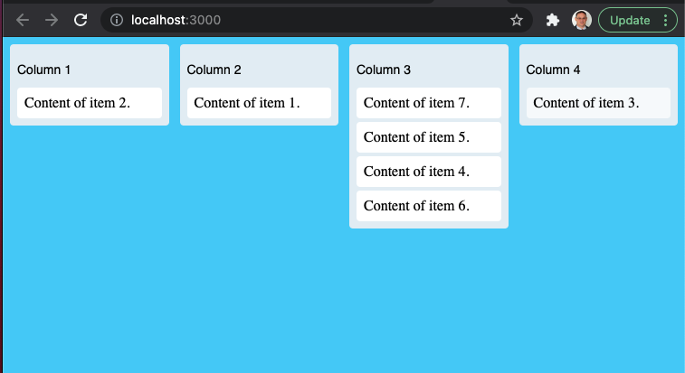

# react-dnd-task
This repo contains the source code for a drag-and-drop task board.

## Assessment Tasks:
### 1. Extend the project so that new tasks can be added
### 2. Extend the project so that tasks can be edited and saved
### 3. Extend the project so that columns can be dragged into a different order.

## How to submit your work.
Create a new branch for your work.
Commit you work into this new branch
Submit a Pull Request for you changes.